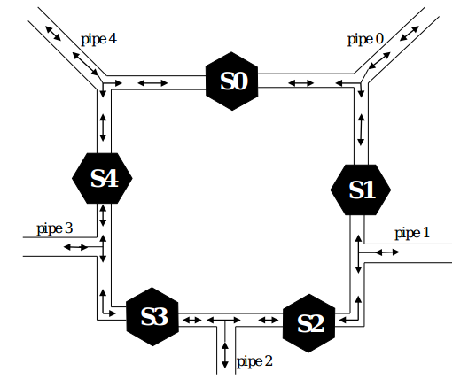

#Multithreading Water Treatment Plant Simulation

##DESCRIPTION

This example water treatment plant has five pumping stations (S0 – S4), each of which has an input
and output pipe connecting to lines (P0 – P4) that go elsewhere in the plant. Resources were limited
when building the plant so each pipe going to the rest of the facility must be shared between two
pumping stations. Since each station simultaneously needs an input and output connection to
function, access to the shared lines must be strictly regulated. Flow direction in not important in our
simulation.
